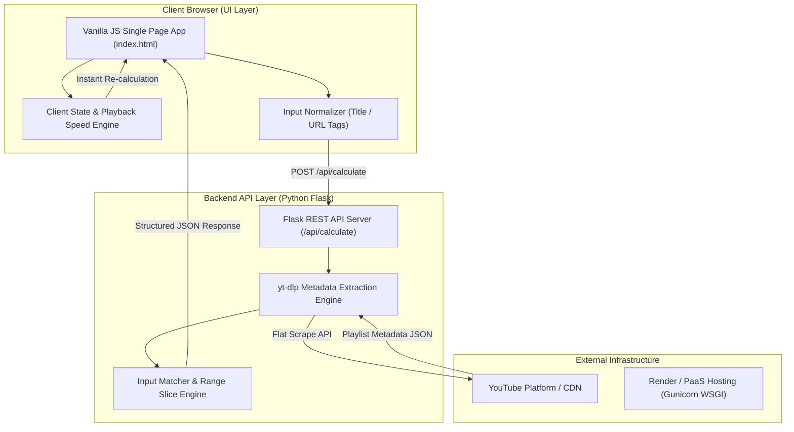
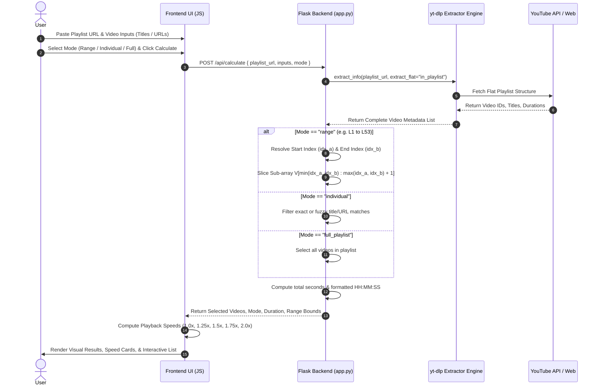

# 🏗️ Architecture Documentation: YouTube Playlist Duration Calculator

This document details the architectural design, system workflow, technology stack selection, and rationale behind the **YouTube Playlist Duration Calculator**.

---

## 📐 System Architecture Overview

The system follows a lightweight **Decoupled Client-Server Architecture** optimized for high performance, low latency, and zero-client-bundle footprint.

---

## 🧬 Component Architecture & Sequence Flow

### 1. Range & Video Duration Processing Sequence

---

## 🛠️ Key Technologies & Stack Rationale

| Layer | Technology Selected | Rationale & Advantage for This Task |
| :--- | :--- | :--- |
| **Frontend Framework** | **Vanilla HTML5 / CSS3 / ES6+ JS** | **Zero Bundle Overhead**: Eliminates React/Vue bundle latency. Loads instantly in the browser. Handles playback speed recalculations locally in `< 1ms` without network requests. |
| **Styling & Theme** | **Custom Vanilla CSS (Glassmorphic Dark)** | Modern dark aesthetic using CSS custom properties (variables), backdrop filters, and keyframe animations. Provides a premium feel without heavy utility frameworks like Tailwind. |
| **Backend Framework** | **Python Flask** | Minimalist WSGI micro-framework with low memory footprint. Perfect for wrapping python-native data manipulation and `yt-dlp` extraction pipelines. |
| **Metadata Scraper** | **`yt-dlp` (v2026.7.4+)** | **High Reliability & Speed**: Bypasses official YouTube API v3 quota limits and cost restrictions. Uses `extract_flat: in_playlist` to fetch metadata for 300+ videos in seconds without downloading video payloads. |
| **WSGI Server** | **Gunicorn (Green Unicorn)** | Production-grade HTTP server with pre-fork worker model and configurable worker timeouts (`120s`) to ensure long playlist requests never time out on cloud proxies. |
| **Deployment & Hosting**| **Render PaaS + Vercel Serverless** | Automated Git-triggered CI/CD pipeline. Includes `render.yaml`, `Procfile`, and `vercel.json` for zero-configuration, cost-effective, scalable cloud deployment. |

---

## ⚡ Key Architectural Innovations & Optimizations

### 1. Two-Pass Non-Blocking Metadata Extraction Strategy
- **Pass 1 (Flat Scrape)**: `yt-dlp` executes flat playlist parsing (`extract_flat="in_playlist"`), extracting Video IDs, Titles, and Durations for hundreds of videos in a single network round-trip.
- **Pass 2 (Fallback Precision Resolution)**: If an individual video lacks metadata due to YouTube API layout shifts, the backend conditionally fetches duration metadata only for missing entries, preventing full-playlist blockages.

### 2. Dual Input Resolution Engine (URLs + Substrings)
The engine resolves input tags dynamically:
- **Regex Pattern Normalization**: Extracts standard 11-character YouTube video IDs from `watch?v=`, `youtu.be/`, `shorts/`, or `embed/` URLs.
- **Fuzzy Substring Search**: Performs case-insensitive substring matching against video titles (e.g. matching `"L1. Introduction"` or `"L53. Largest BST"`).

### 3. Sub-Array Slice Algorithm for Range Calculation
For a playlist of $N$ videos $V = [v_0, v_1, \dots, v_{N-1}]$:
$$\text{idx}_{\text{start}} = \min(i_A, i_B), \quad \text{idx}_{\text{end}} = \max(i_A, i_B)$$
$$\text{Selected Subset} = V[\text{idx}_{\text{start}} : \text{idx}_{\text{end}} + 1]$$
$$\text{Total Duration} = \sum_{k=\text{idx}_{\text{start}}}^{\text{idx}_{\text{end}}} \text{Duration}(v_k)$$
This guarantees that all intermediate videos are automatically included in the duration calculation with $O(N)$ index resolution complexity.

### 4. Client-Side Real-Time Playback Speed Engine
Instead of re-querying the backend when users toggle playback speeds (`1.25x`, `1.5x`, `1.75x`, `2.0x`), the client recalculates target durations instantaneously:
$$T_{\text{adjusted}} = \left\lfloor \frac{T_{\text{baseline}}}{\text{Speed}} \right\rfloor, \quad T_{\text{saved}} = T_{\text{baseline}} - T_{\text{adjusted}}$$
This eliminates unnecessary backend API calls and delivers instant feedback to the user.

---

## 🛡️ Scalability & Reliability Measures

1. **Gunicorn Timeout Configuration**: Set to `120s` with multi-worker support to handle extra-large playlists (300+ items).
2. **Environment Port Binding**: Binds dynamically to `os.environ.get("PORT")` for PaaS cloud platforms.
3. **Decoupled Architecture**: Frontend and backend communicate via clean JSON contracts, enabling easy swap of backend extraction mechanisms if YouTube endpoints change.
